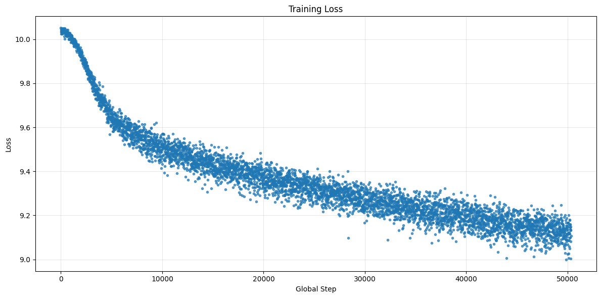
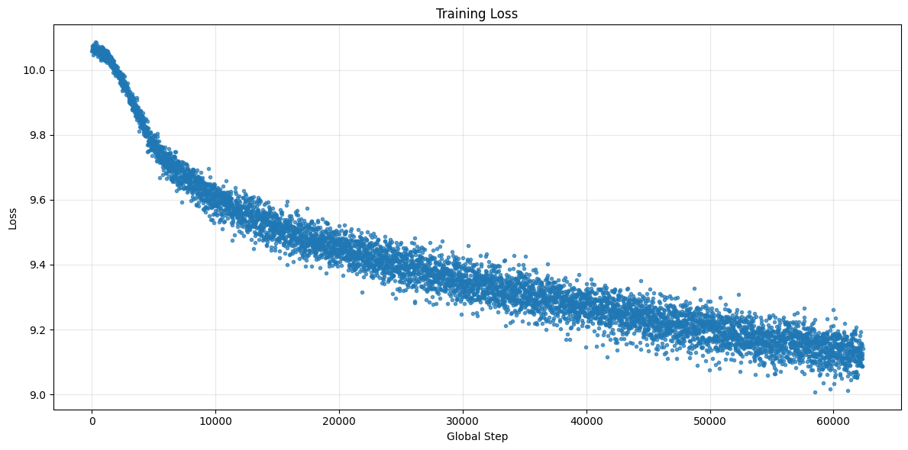
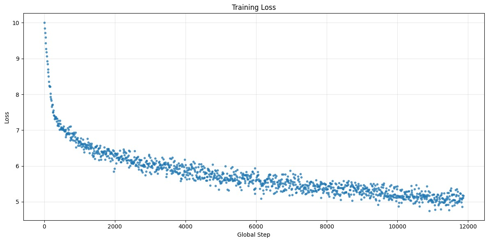
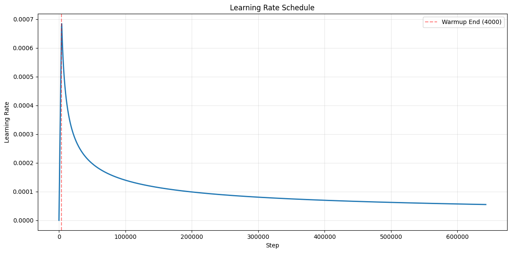
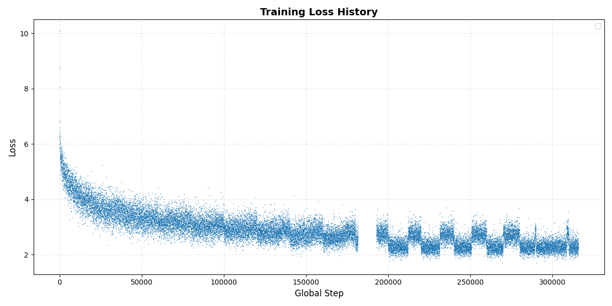

# Annotazioni Prove di Addestramento - Tuning Iperparametri

Documentazione delle varie run di addestramento per la selezione degli iperparametri ottimali.

- **p**: Percentuale di dropout
- **eta (η)**: Learning rate

## Scheduler - Attention Is All You Need

$$\text{lrate} = d_{\text{model}}^{-0.5} \cdot \min(\text{step\_num}^{-0.5}, \text{step\_num} \cdot \text{warmup\_steps}^{-1.5})$$

---

## Dropout p=0.1

**Iperparametri:**
- Dropout rate (p): 0.1
- Learning rate (η): Scheduler [Vaswani et al.]

**Osservazioni:**

**Loss Plot:**

---

## Dropout p=0.3

**Iperparametri:**
- Dropout rate (p): 0.3
- Learning rate (η): Scheduler [Vaswani et al.]

**Osservazioni:**

**Loss Plot:**

---

## Learning Rate η=10e-2 (0.1)

**Iperparametri:**
- Dropout rate (p): 0.1
- Learning rate (η): 10e-2, costante - Scheduler off

**Osservazioni:**

**Loss Plot:**

---

## Scheduler Plot

**Descrizione:** Andamento del learning rate

---

## Run Fallita - Bad Loss

**Descrizione:** Prova che ha mostrato problematiche

**Iperparametri:**
- Dropout rate (p): [da specificare]
- Learning rate (η): [da specificare]
- Epoch: [da specificare]

**Problema Riscontrato:** Il modello non rientrava in modalità train al termine della validation. Questo avveniva con periodo 10k iterazioni, portando ad uno sfasamento rispetto alle epoche, all'inizio delle quali il modello rientrava in modalità train. A nostro avviso, questo spiega l'andamento a dente di sega con spessore che cala nel tempo.

---

## Conclusioni

### Migliore Configurazione:
- **Dropout (p)**: 
- **Learning Rate (η)**: 
- **Motivazione**: 

---

## Note Aggiuntive
